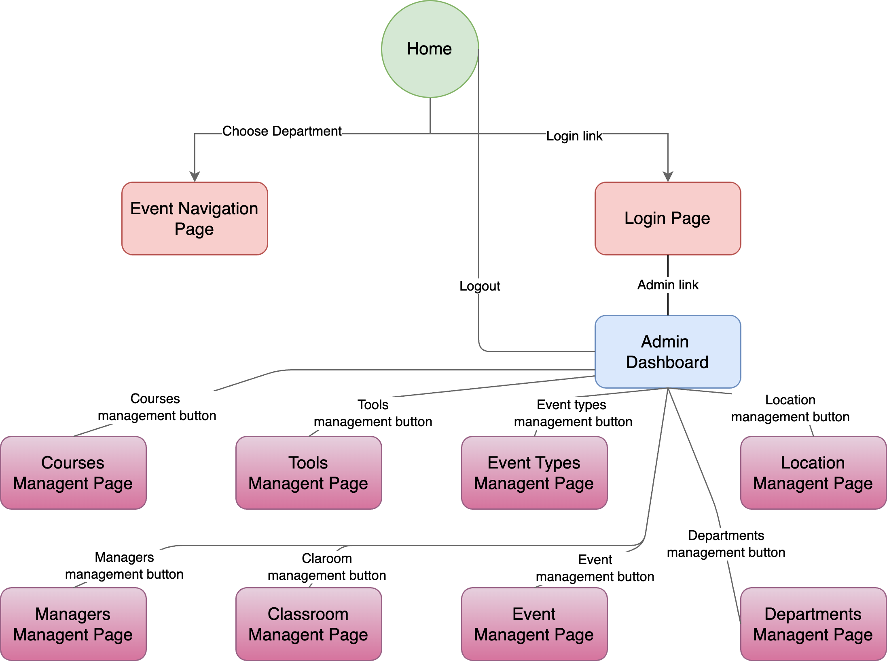
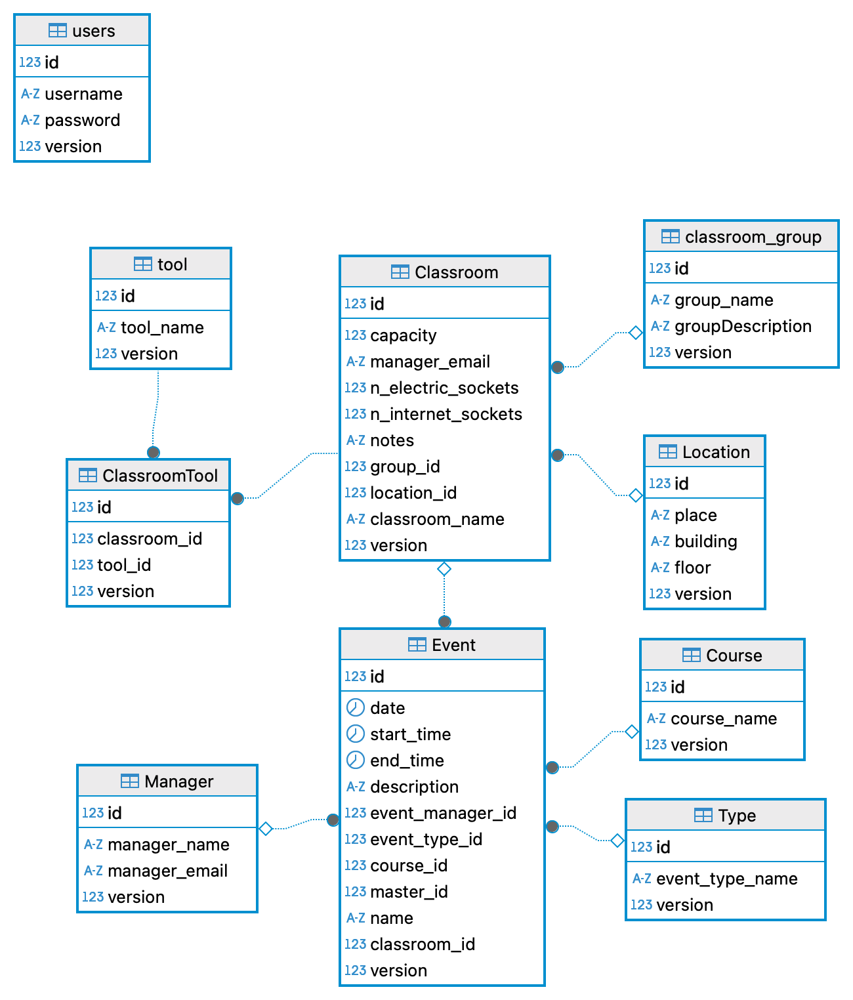
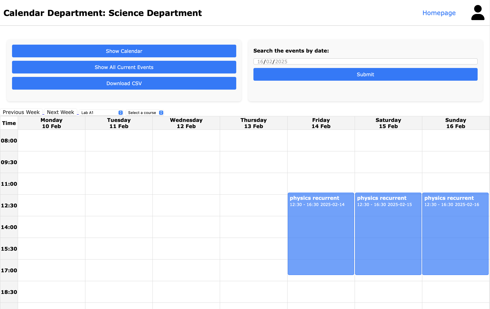
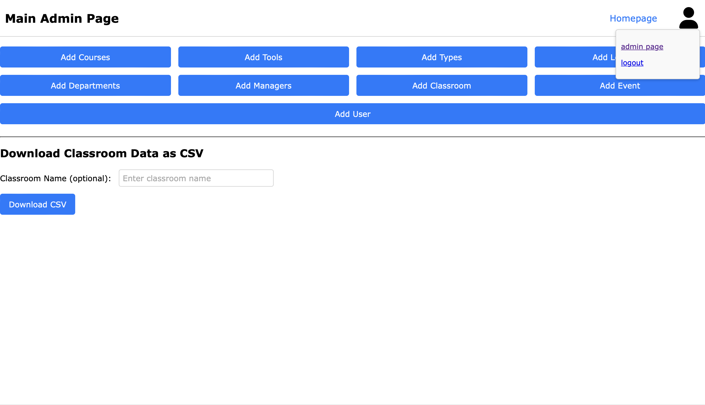
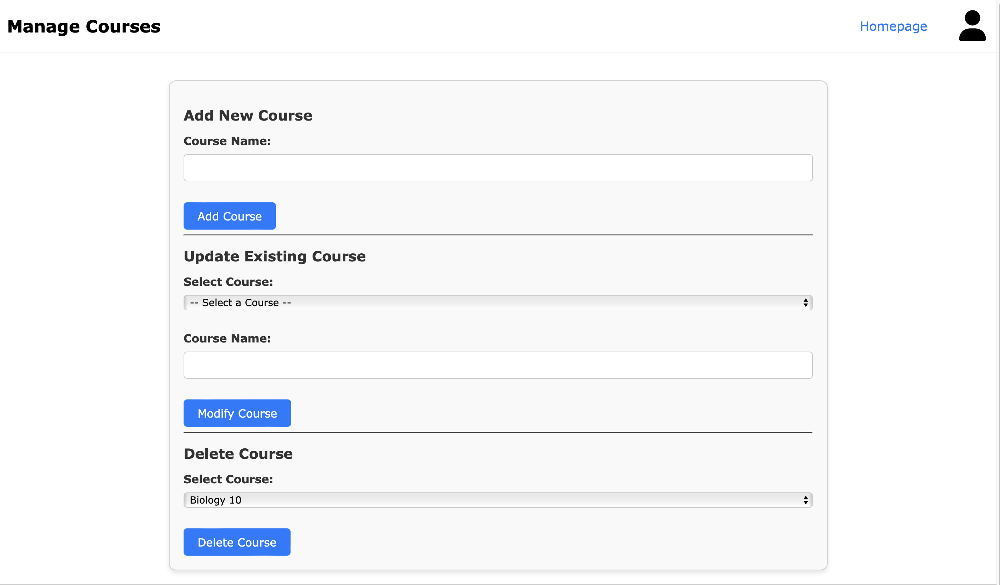
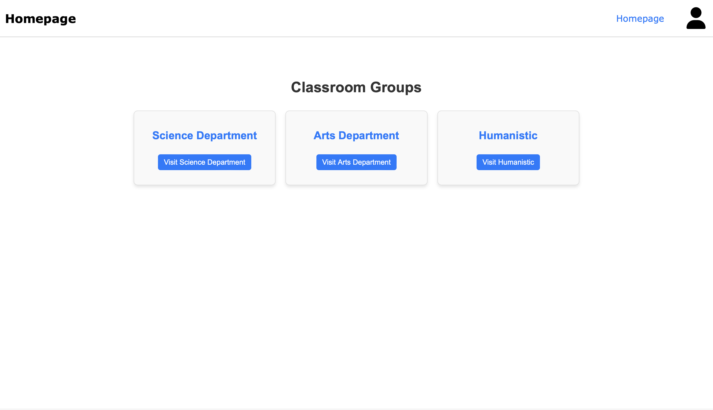

## AuleWeb

---

## Contents
1. [Introduction](#introduction)
2. [Software Dependencies](#software-dependencies)
    - [Server-Side Dependencies](#server-side-dependencies)
    - [Client-Side Dependencies](#client-side-dependencies)
    - [Build and Deployment Tools](#build-and-deployment-tools)
3. [Functionalities Implemented (and Not Implemented)](#functionalities-implemented-and-not-implemented)
    - [Implemented Functionalities](#implemented-functionalities)
    - [Not Implemented or Partially Implemented](#not-implemented-or-partially-implemented)
4. [Relational Schema of the Database](#relational-schema-of-the-database)
    - [Core Entities](#core-entities)
    - [Event Management](#event-management)
    - [Relationships and Constraints](#relationships-and-constraints)
5. [Analytical Description of the Site Layout](#analytical-description-of-the-site-layout)
    - [Overall Structure](#overall-structure)
    - [Administrative Interface](#administrative-interface)
    - [Static and Dynamic Components](#static-and-dynamic-components)
    - [Styling and Layout Approach](#styling-and-layout-approach)
6. [Cross-Browser Programming & Rendering](#cross-browser-programming--rendering)
    - [List of Compatible Browsers](#list-of-compatible-browsers)
    - [Encountered Issues](#encountered-issues)
    - [Degradation](#degradation)
7. [Screenshots](#screenshots)

---

## 1. Introduction
This document provides an overview of the development and implementation of the **AuleWeb** project, created as part of the Web Engineering course for the academic year 2023/2024. The project follows the provided specification—which outlines the requirements for a classroom management system inspired by the existing university platform *Aule Univaq*.

The AuleWeb system facilitates classroom organization by allowing users to view, manage, and assign events to classrooms within configurable groups. Its functionalities include event scheduling, classroom availability visualization, recurring event handling, and CSV export. Additionally, it offers administrative features for managing classroom configurations and equipment lists.

The project is developed using Java Servlets for server-side logic, JavaScript for client-side interactions, and Freemarker as a template engine to maintain a clean separation between presentation and logic. It adheres to web standards for cross-browser compatibility while providing an intuitive user experience.

---

## 2. Software Dependencies
This project uses a combination of server-side and client-side technologies to implement its features. Below is an overview of the dependencies, their versions, and their purposes.

### 2.1 Server-Side Dependencies
The back-end is built using Java Servlets and additional libraries for template rendering, database access, and CSV handling. Managed via Maven, the key dependencies are:
- **Freemarker 2.3.33** – Template engine to separate logic from presentation.
- **Freemarker Java 8 Extension 3.0.0** – Supports Java 8’s `java.time` API in Freemarker.
- **MySQL Connector 8.0.33** – JDBC driver for MySQL database interaction.
- **Java Servlet API 4.0.0** – Core functionality for handling HTTP requests and responses.
- **JSP API 2.3.0** – Enables dynamic web content via JavaServer Pages.
- **Expression Language (EL) API 3.0.0** – Handles dynamic expressions within JSP pages.
- **Java WebSocket API 1.1** – Enables real-time bidirectional communication.
- **Java Security API 1.0** – Provides security mechanisms for enterprise applications.
- **Java Annotation API 1.3.2** – Supports annotation-based configurations.
- **Apache Commons CSV 1.12.0** – Facilitates CSV file operations for data export.

The project is built with Maven and uses the Maven Compiler Plugin 3.13.0 to ensure compatibility with Java 14.

### 2.2 Client-Side Dependencies
The front-end is developed using HTML5, CSS, JavaScript, and Freemarker. The following libraries and frameworks are used:
- **jQuery** – For DOM manipulation, AJAX requests, and event handling.
- **Freemarker** – For rendering dynamic HTML templates server-side.

The design follows modern web practices to ensure accessibility and responsiveness.

### 2.3 Build and Deployment Tools
- **Packaging:** The project is packaged as a WAR (Web Application Archive).
- **Server:** Deployed on Apache Tomcat to provide the runtime environment for Java Servlets and JSP pages.
- **Maven WAR Plugin 3.4.0:** Used to facilitate WAR packaging.

---

## 3. Functionalities Implemented (and Not Implemented)

### 3.1 Implemented Functionalities
The AuleWeb system meets all the core requirements specified. Key functionalities include:
- Displaying classrooms by group.
- Showing events associated with a specific classroom for a given week.
- Displaying events for each classroom on a given day.
- Listing all current events (in progress) and those scheduled for the next three hours.
- Showing events for a specific course on a weekly basis.
- Exporting events in CSV format for a specified time interval (with optional course filtering).
- Administrative capabilities for:
  - Inserting and modifying classroom configurations and groups.
  - Inserting and editing events (including recurring events).
  - Managing the list of available equipment.
  - Exporting and importing classroom configurations via CSV.

### 3.2 Not Implemented or Partially Implemented
- The only optional feature from the project specification was exporting events in iCalendar format. The project opted exclusively for CSV export using Apache Commons CSV.
- No additional functionalities were omitted or left incomplete.

*Note: An activity diagram (Figure 1) represents the navigation structure and relationships between different pages of the website.*

---

## 4. Relational Schema of the Database
The database is structured using MySQL and follows a relational model designed to efficiently manage classrooms, events, and administrative configurations.

### 4.1 Core Entities
- **classroom:** Represents classrooms with attributes such as name, capacity, location, manager email, available equipment, and group.
- **classroom_group:** Defines groupings of classrooms (e.g., by department) with name and description.
- **location:** Stores physical location details, including place, building, and floor.
- **manager:** Contains names and emails of event managers responsible for scheduling.
- **course:** Lists university courses linked to events like lectures or exams.
- **type:** Defines event categories such as lecture, final exam, seminar, or meeting.
- **users:** Manages system users and stores authentication credentials.

### 4.2 Event Management
- **event:** Records events assigned to classrooms, detailing date, start/end times, description, associated course, event type, and manager.
- **classroom_tool:** Maps available tools (e.g., projectors, microphones) to classrooms to track equipment usage.

### 4.3 Relationships and Constraints
- **classroom** references both `classroom_group` and `location` for logical and physical associations.
- **event** maintains foreign key constraints to `classroom`, `manager`, `course`, and `type` to ensure scheduling integrity.
- **classroom_tool** enforces a many-to-many relationship between classrooms and tools.
- Foreign keys use `ON DELETE SET NULL` or `ON DELETE CASCADE` to maintain record consistency upon deletions.

*The relational diagram (Figure 2) illustrates the connections between these tables.*

---

## 5. Analytical Description of the Site Layout

### 5.1 Overall Structure
The AuleWeb layout is designed for an intuitive user experience. The key sections include:
- **Header:**
  - A link to the homepage.
  - A dynamic page title reflecting the current page.
  - An icon for authentication:
    - Links to the login page if the user is not logged in.
    - Displays links to the admin page and logout option if logged in.
- **Main Content:**
  - Departmental calendars for selection and viewing.
  - Classroom events displayed weekly with forward/backward navigation.
  - A list of current and recently started events.
  - Daily event views.
  - Weekly course-specific event views.
  - CSV export functionality for events within a chosen date range.
- **Navigation and Interaction:**
  - Dynamic department selection on the homepage.
  - GET request-based URL updates for week navigation.
  - AJAX-based content updates for specific day and current events without full page reloads.

### 5.2 Administrative Interface
Administrators have access to additional features via a dedicated admin workflow:
- **Login Page:** Admin users authenticate through a specialized login form.
- **Admin Dashboard:** Provides a control panel with access to various database management pages.
- **Database Interaction via Forms:**
  - Forms display initial selection options (e.g., classroom list).
  - Upon selecting an entity, fields (location, manager, capacity, etc.) auto-populate with current data.
  - New entries are added via empty fields for manual input.
  - Date range filters simplify event deletion or modification.
- **Classroom Data Export:** Allows CSV export of classroom data from the main admin page.

### 5.3 Static and Dynamic Components
- **Static Elements:**
  - Consistent header and authentication controls.
  - Static homepage structure with dynamic department options.
- **Dynamic Elements:**
  - Event listings retrieved and updated from the database based on navigation.
  - Content updates triggered by user interactions (e.g., department selection, week changes, filtering).
  - Admin interface forms that auto-populate data for editing and deletion.

### 5.4 Styling and Layout Approach
- **CSS:** Ensures a clean, readable, and responsive interface.
- **Freemarker Templates:** Render dynamic HTML content while keeping logic separate.
- **JavaScript and jQuery:** Enhance interactivity, particularly for AJAX-driven updates.

---

## 6. Cross-Browser Programming & Rendering

### 6.1 List of Compatible Browsers
The system was tested on the following browsers:
- **Edge** (latest version at the time of testing)
- **Chromium-based browsers:**
  - **Chrome** (latest version)
  - **Brave** (latest version)
- **Safari** (latest version on macOS)

### 6.2 Encountered Issues
No significant rendering or functionality issues were encountered across the tested browsers. The application maintains consistent behavior on Edge, Chromium-based browsers, and Safari.

### 6.3 Degradation
The AuleWeb system depends on JavaScript for key functionalities:
- Dynamic event retrieval via AJAX (fetch API).
- Auto-population of forms in the admin interface.
- Page updates based on user interactions (e.g., week navigation).

*Note:* If JavaScript is disabled, these dynamic features will not function, although basic navigation remains possible.

---

## 7. Screenshots

<strong>Website Screenshots</strong>

